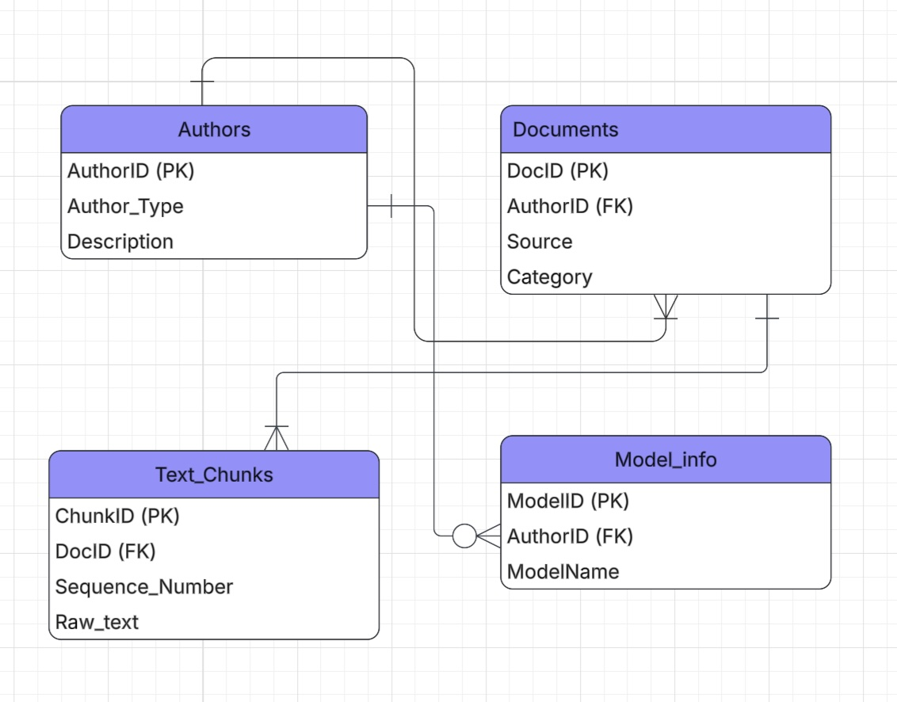

# Project Details
DS 4320 Project 1: Detecting AI Generated Academic Writing in Transformer Model LLMs

Executive Summary - Short paragraph explaining the
contents of the respository in executive form
This repository contains the data engineering pipeline and analytical proof-of-concept for Project 1, which addresses the challenge of detecting synthetic academic text generated by Transformer-based LLMs (e.g., ChatGPT, Llama). To facilitate this analysis, I engineered a relational database by ingesting, normalizing, and tokenizing over 100,000 academic abstracts and essays from three distinct datasets (DAIGT, SciHRA, Ateeqq) from Kaggle and Hugging Face. Using Python, PyArrow, and DuckDB, the text was parsed into sentence-level chunks to calculate variance in structural rhythm (burstiness). This repository houses the data acquisition scripts, a Press Release of the findings, and the complete data-to-solution machine learning pipeline.

Name: Anna Yao
Computing ID: zzz2bx
DOI - create a DOI for your project — — 
Press Release - link to press release — — 
Data - link to data folder — — 
Pipeline - link to pipeline files — — 
License State name of license here and link to the file in the
top level of the repository (use normal GitHub conventions)

## Problem Definition
Initial general statement: It is increasingly difficult to distinguish between text written by a human and text generated by AI.
Specific problem: Is it possible to identify the specific structural and lexical markers such as variations in perplexity and burstiness that differentiate human-authored text from modern transformer models like gemini or ChatGPT in academic writing?

Rationale for Refinement
The initial problem is too broad because "AI" encompasses many different algorithms, and "text" can range from tweets to novels. Attempting to build a universal detector is currently unfeasible due to the rapid evolution of generative models. By refining the scope to focus specifically on academic text and anchoring the analysis on how transformer models calculate token probabilities (which results in lower perplexity and burstiness compared to human writers), the problem becomes a quantifiable, supervised classification task. This allows for targeted feature engineering rather than relying on a black-box approach.

Project Motivation
As generative language models become more accessible and sophisticated, the internet is rapidly filling with synthetic text. This poses a significant threat to academic integrity, the spread of misinformation, and general trust in digital communication. Traditional plagiarism detectors look for exact string matches and are entirely ineffective against novel AI-generated content. Developing a reliable, mathematically grounded method to detect synthetic text is critical for educators, publishers, and platforms to maintain the authenticity and credibility of written media.

Unpacking the Patterns behind AI Generated Text
--- MAKE ANCHOR LINK ---
file containing the press release

## Domain Exposition

Terminology

|Term|Definition|
|:---|:---|
|Perplexity|A measurement of how well a probability model predicts a sample. In NLP, it measures how "surprised" a model is by a sequence of words.|
|Burstiness|The variation in sentence length and structure within a document.|
|Transformer Architecture|The underlying neural network structure of modern LLMs (like GPT or BERT) that uses self-attention to process sequential data.|
|Large language model|A deep learning algorithm trained on massive datasets to recognize, summarize, translate, predict, and generate text.|
|Academic|Of or relating to education or scholarly pursuit, describing intellectual study|

Domain of Project
This project operates within the domain of Natural Language Processing (NLP) and cybersecurity, specifically focusing on synthetic media detection and text forensics. While generative AI focuses on natural language generation (NLG), this domain focuses on natural language understanding to reverse-engineer the footprint left by those generative models. The ultimate goal in this domain is not just binary classification, but building clear data visualizations and interpretability tools so end-users can understand why a piece of text was flagged.

Background reading Separate folder containing copies
of articles, blog posts, etc. about the project topic (1 point
per, up to 5 points, can do more). These should help the
reader understand the domain of the project.

Table - showing a summary of the readings, one row per
item, includes title, brief description, and link to file in folder

## Data Creation 
To acquire my data, I looked on kaggle and hugging face to find existing academic human and AI writing. After finding three datasets that had similar structure, I downloaded the datasets and feature engineered them down to the information I needed - the label (human or AI), model type, text, and text category. From there, I feature engineered the text to be dissolved into text chunks for easier ML down the rode. These featured allowed me to build my 4 tables - author, model, text document, and text chunk. Altogether, I acquired ~160 MB worth of parquet data, which was about 1.7 million rows of data combined across all 4 tables. This data was stored in these parquet files in a UVA OneDrive folder, and used in code locally.

|Code|Description|Link|
|---|---|---|
|data_acquisition.ipynb|Extracted 3 open source datasets and transformed them into 4 parquet tables of data|https://github.com/annayao0602/DS-4320-Project-1/blob/main/data_acquisition.ipynb|

There could be potential bias in the data collection process due to the datasets used. Since the data wasn't collected directly but just came from these datasets, any previous bias in those datasets could be present. This includes the prompts which were fed to the models, the types of models that were used (model representation bias), and language bias. Since all of the writing in this dataset is in English, this project may not be applicable to other languages.

To mitigate these biases, it is possible to account for equal representation of model types present (ex. using llama outputs just as often as gpt) or to at least have an understanding of separation of models. This would help mitigate treating AI as a monolith. Additionally, since this dataset still contains the category and source of the documents, it is possible to trace back domain bias within these specific categories.

Instead of feeding the entire document of text at once to ML, I decided to tokenize text into sentence chunks while still maintaining its order within the greater text. This allows for a more streamlined approach to feeding the model inputs, while still keeping the context in which the sentence was in. Additionally, I decided to overlap author tags (human) to maintain a strict primary key, preventing a 1-to-many relationship.

## Metadata 

|Table Name|Description|Link to file|
|---|---|---|
|Authors|Tracks the source of text|https://myuva-my.sharepoint.com/:u:/g/personal/zzz2bx_virginia_edu/IQBeqwKnCLHbSoPYqrQ0wO7lARq7jZ0xKq8yEvqQ-4-dvms?e=VABw7L|
|Documents|Text records|https://myuva-my.sharepoint.com/:u:/g/personal/zzz2bx_virginia_edu/IQDkcX2N3sTxQJ9Oz7infXTFAQWLmv6QwtPGcoFRKSankaI?e=v0QZmC|
|Text_Chunks|Breakdown of documents for analysis|https://myuva-my.sharepoint.com/:u:/g/personal/zzz2bx_virginia_edu/IQBETwVlWI6bR4fkDXalbR7cAWc8W27MyI5jyqp5hPF6G7I?e=XSthlV|
|Model_info|Information of models used|https://myuva-my.sharepoint.com/:u:/g/personal/zzz2bx_virginia_edu/IQD4PsCB1hcsTaa_X-VByiY-AXsccCrlR0irMGcn5UOOmac?e=77cX7y|

|Feature Name|Table|Data Type|Description|Example|
|---|---|---|---|---|
|Author_ID|Authors|String (PK)|Unique identifier for the text creator.|AUTH_HUMAN|
|Author_Type|Authors|String|Categorical label indicating if the text is natural or synthetic.|AI|
|Description|Authors|String|Brief text context about the author or model.|Original Academic Author|
|Model_ID|Model_Info|String (PK)|Unique identifier for the specific LLM architecture.|MOD_GPT4O|
|Author_ID|Model_Info|String (FK)|Foreign key linking the model back to the Authors table.|AUTH_AI_01|
|Model_Name|Model_Info|String|The human-readable version/name of the AI model.|ChatGPT 4o|
|Doc_ID|Documents|String (PK)|Unique UUID assigned to each full-length essay or abstract.|550e8400-e29b-41d4-a716-446655440000|
|Author_ID|Documents|String (FK)|Foreign key linking the document to its creator.|AUTH_AI_LLAMA|
|Source|Documents|String|The origin dataset or corpus the text was scraped from.|SciHRA-Academic|
|Category|Documents|String|The specific prompt, domain, or title of the original text.|Phones and driving|
|Chunk_ID|Text_Chunks|String (PK)|Unique UUID for every single parsed sentence.|123e4567-e89b-12d3-a456-426614174000|
|Doc_ID|Text_Chunks|String (FK)|Foreign key linking the sentence back to its parent document.|550e8400-e29b-41d4-a716-446655440000|
|Sequence_Number|Text_Chunks|Integer|The chronological order (index) of the sentence within the document.|0, 1, 2|
|Raw_Text|Text_Chunks|String|The actual text data of the individual sentence.|The study aims to examine the role of cells.|

The Sequence_Number feature in the Text_Chunks table tracks the total number of sentences in a document and their specific order. However, there is an inherent margin of uncertainty (around 2-5%) in this numerical sequence due to the limitations of the Natural Language Toolkit (NLTK) sent_tokenize library used during data generation. When analyzing burstiness in the pipeline, this uncertainty is mitigated by viewing thousands of chunks rather than just absolute sequence maximums from a single document.

—
