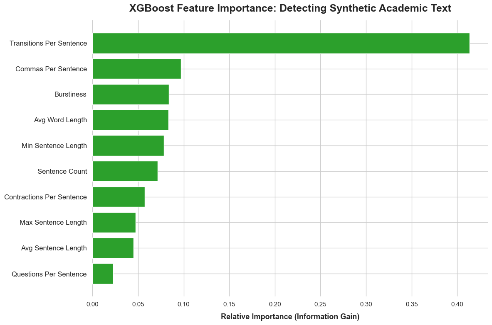

# Unmasking the Machine: Detecting AI Written Academic Text with 90% Accuracy

## Finding the Robotic Accent
As Large Language Models become increasingly sophisticated, distinguishing between human ingenuity and artificial generation in academic writing has never been more critical. We have cracked the code not by analyzing *what* is being said, but by measuring the hidden mathematical rhythm of *how* it is structured.

## Problem Statement: Who Wrote What?
The rapid adoption of generative AI has flooded academia with synthetic text, threatening academic integrity. Traditional AI detectors are falling behind due to the advancements seen in AIs today. As AI models learn to mimic human word choices more effectively, these traditional tools frequently flag human work as AI written incorrectly or miss AI-generated essays entirely. The core problem is that we are trying to catch next-generation AI using outdated, word-level scanning techniques. We need a reliable way to detect the underlying "robotic blueprint" that AI models cannot easily hide when generating long-form academic essays using more specified methods, like examining grammar and sentence dynamics.

## Solution Description: Structural Fingerprinting
Our solution abandons vocabulary matching entirely in favor of structural linguistic analysis. Instead of analyzing individual words, our machine learning tool looks at the "rhythm" and "blueprint" of an essay. 

Because AI models are trained using reinforcement learning to be incredibly helpful and organized, they rigidly adhere to formulaic essay formats. By measuring the density of transition words (like "Furthermore" and "Moreover"), the variance in sentence length, and punctuation habits, our machine learning model successfully identifies the rigid, mechanical patterns of AI. It acts as a structural fingerprint scanner, successfully classifying 9 out of 10 documents as either human or AI without ever needing to understand the actual topic of the essay. This could be especially true due to the academic nature of these texts that are being examined, which could conform the generated text to be even more rigid and structure.

## Chart
To understand exactly how the algorithm separates human from machine, we mapped out the most important structural "tells."

*Figure 1: The model's decision-making hierarchy, showing Information Gain by feature (the elements of the text).*

As shown in the chart above, **Transitions Per Sentence** makes up most of the information gain, making it a huge signifier. While human academics naturally write with less words and use conceptual bridges to link their ideas, AI models mathematically over-rely on mechanical transition words to structure their paragraphs. By isolating these structural crutches, we can reliably detect artificial generation. Other tells, such as comma usage and sentence length are also giveaways for these generated texts.
